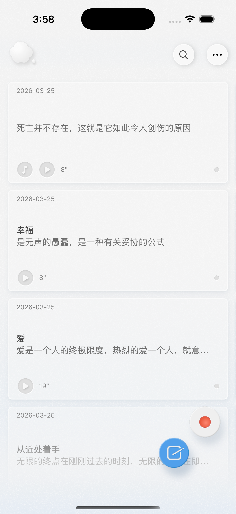
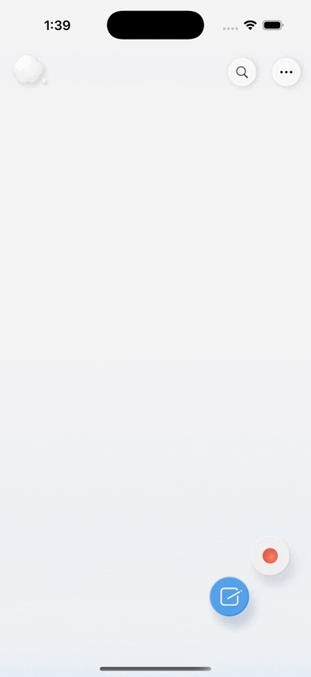
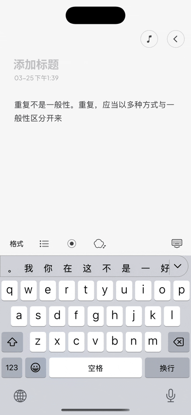
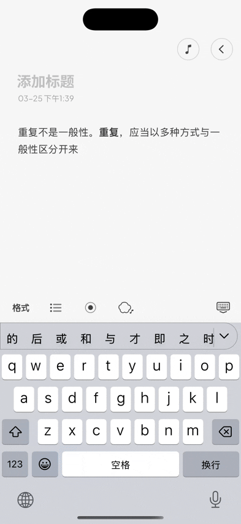
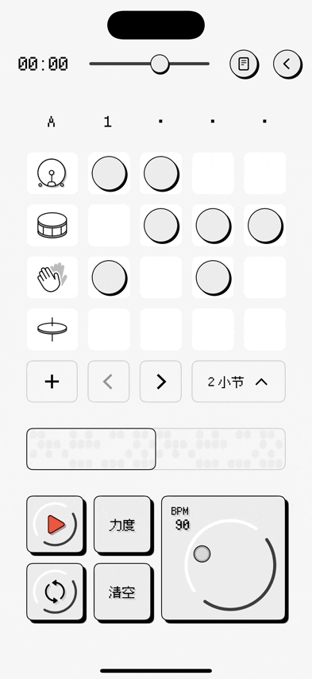
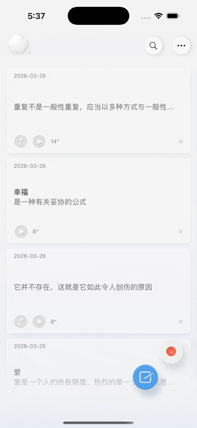

# 云云 ☁️☁️

> 翻到想法的 B 面 —— AI 笔记&音乐创作 app —— 让“做音乐”真正从想法，而不是工具开始


## 功能亮点

- **录音笔记** — 实时语音转文字，多段录音合并，本地存储
- **富文本编辑** — 文本格式工具栏，
- **鼓机编辑器** — 16 步序列器，播放控制，AudioKit 多轨同步播放，MIDI 文件存储
- **AI 生成** — 挖掘文字情感与思考；一键转化为鼓点节拍
- **卡片系统** — 笔记、录音、音乐绑定为一张卡片，3D 翻转查看两面内容
- **iCloud 同步** — SwiftData 本地持久化 + CloudKit 跨设备同步


## 技术栈

| 层级 | 技术 |
|------|------|
| UI | SwiftUI · UIKit· Metal Shader（特殊动效） |
| 音频 | AVAudioEngine · AudioUnit RemoteIO · AudioKit · RingBuffer|
| AI | LLM · SSE 流式响应 |
| 数据 | SwiftData · CloudKit · iCloud File · MySQL · SQLAlchemy ORM · Alembic |
| 后端 | Python 3.11 · FastAPI · Uvicorn |
| 支付 | StoreKit 2 · RevenueCat（订阅管理 + Webhook）|
| 其它 | Apple Sign In · StoreKit 2 · ASR 语音识别 |
| 部署 | Docker · Docker Compose · 阿里云 RDS |


## Demo



| 录音笔记 | 富文本编辑 |
|:---:|:---:|
|  |  |

| AI 鼓点生成 | 鼓机编辑器 |
|:---:|:---:|
|  |  |

| 卡片翻转 |
|:---:|
|  |

---

## 技术架构图

```
┌─────────────────────────────────────────────────────────────────┐
│                        UI 层  (SwiftUI)                         │
│                                                                 │
│  ┌─────────────────────────────────────────────────────────┐    │
│  │                       HomePage                          │    │
│  │               卡片列表 · 分组管理 · 搜索                    │    │
│  └─────────────────────────────┬───────────────────────────┘    │
│                                │                                │
│            ┌───────────────────┴────────────────────┐           │
│            ▼                                        ▼           │
│  ┌───────────────────────┐       ┌─────────────────────────┐    │
│  │       EditPage        │       │       RecordPage        │    │
│  │                       │       │      实时ASR转文字        │    │
│  │       富文本编辑        │       │       多段录音合并        │    │
│  └──────────┬────────────┘       └──────────┬──────────────┘    │
│             │                               │                   │
│             └───────────────┬───────────────┘                   │
│                             │                                   │
│  ┌──────────────────────────┴──────────────────────────────┐    │
│  │                   CardDetailPage                        │    │
│  │              文本面/音乐面 · 音频播放控件                    │    │
│  └───────────────────────┬─────────────────────────────────┘    │
│                          │                                      │
│  ┌───────────────────────┴─────────────────────────────────┐    │
│  │                      Music                              │    │
│  │     16步鼓机 · 编排拨盘 · AudioKit多轨 · MIDI文件存储        │    │
│  └──────────┬──────────────────────────────────────────────┘    │
└─────────────┼───────────────────────────────────────────────────┘
              │                                │
              ▼                                ▼

┌─────────────────────────┐    ┌───────────────────────────────┐
│      音频引擎层           │    │          AI 服务层             │
│                         │    │                               │
│  AVAudioEngine          │    │  LLM                          │
│  AudioUnit (RemoteIO)   │    │  流式响应                       │
│  RingBuffer 音频播放      │    │                               │
│  ASR 语音转文字           │    │  ① 文本分析                     │
│  AudioKit 序列器         │    │  ② 鼓点 JSON 生成               │
└──────────┬──────────────┘    └───────────────┬───────────────┘
           │                                   │
           └──────────────┬────────────────────┘
                          ▼
┌─────────────────────────────────────────────────────────────────┐
│             数据层 (本地存储，后端处理计费，APIKEY管理)               │
│                                                                 │
│  ┌──────────────────────────────┐   ┌────────────────────────┐  │
│  │        SwiftData             │   │       CloudKit         │  │
│  │                              │   │                        │  │
│  │  Card  CardBox  MusicSeq     │   │  iCloud 文件同步         │  │
│  │  AudioRecording              │   │  音频 / MIDI 文件        │  │
│  └──────────────────────────────┘   └────────────────────────┘  │
│                                                                 │
│  ┌──────────────┐   ┌─────────────────┐   ┌─────────────────┐   │
│  │ Apple SignIn │   │  StoreKit 2     │   │  Cloud Points   │   │
│  │    登录认证    │   │  订阅管理        │   │  后端处理 AI 计费 │   │
│  └──────────────┘   └─────────────────┘   └─────────────────┘   │
└─────────────────────────────────────────────────────────────────┘
```


---

> 项目源码为 private，本页面仅做展示介绍。
